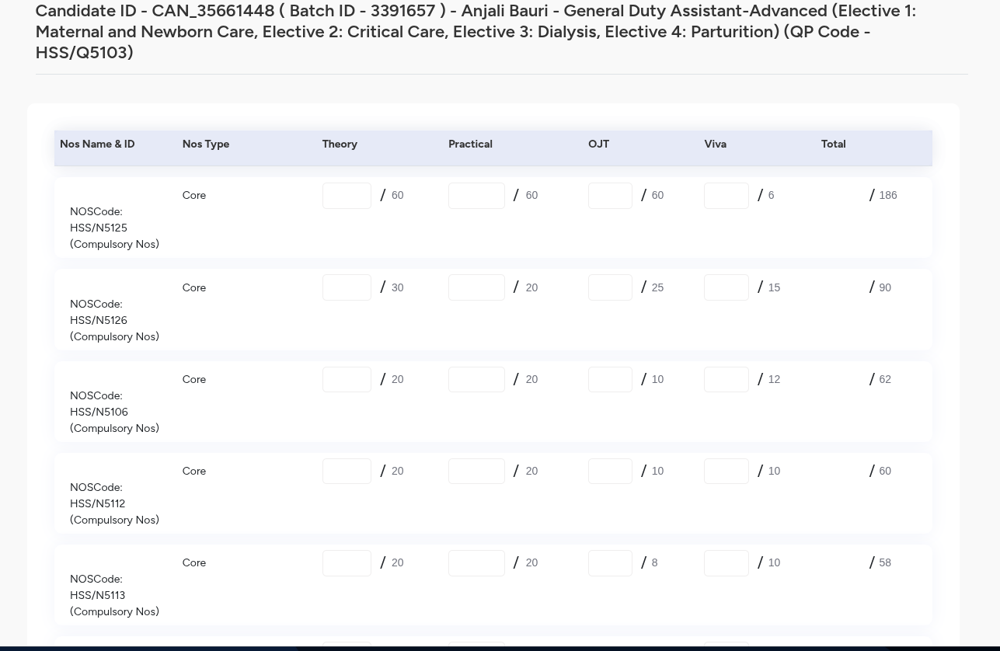

1. go this website https://admin.skillindiadigital.gov.in/admin-profile/assessor/master-assessor/view-batch-details-new/PENDING/3391657;batches=assessment
2. go in approved applicant 
3. search applicant with the Applicant ID that is "Enrollment No. of the candidate" in the excel and click on three dot "view job role detail" then if statuts not uploaded upload marks 
4. upload marks from the excel sheet 
5. then check the grand total mathches with excel that form calculated then upload marks then go to 
6. view job bathces 
7. then search for another student and again repeat the same procedure